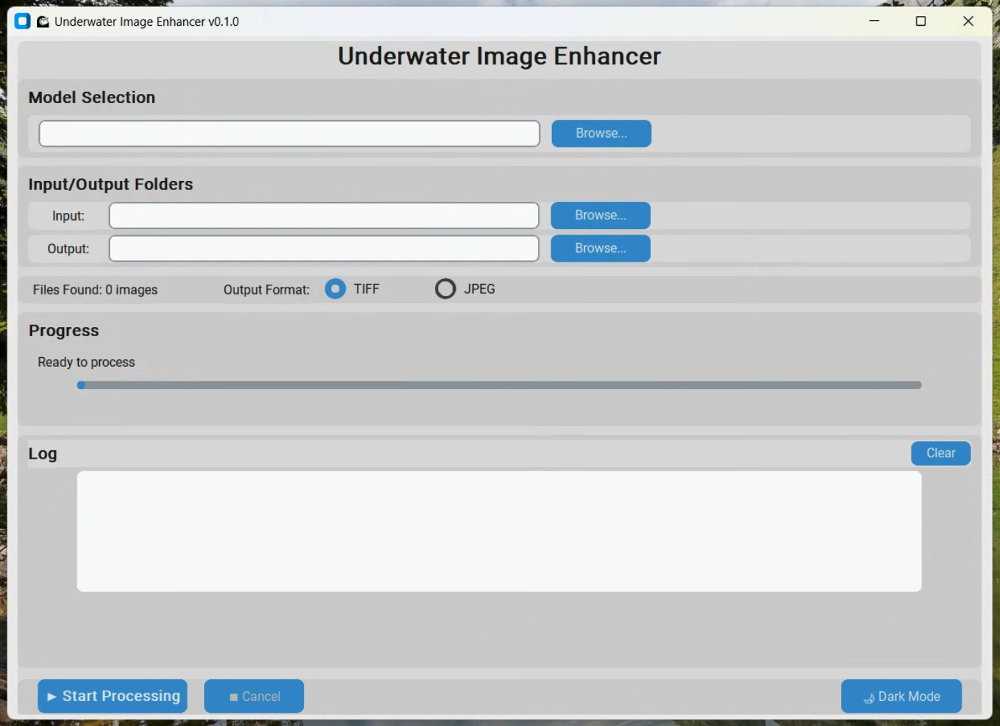

# Underwater Image Enhancement with ML

Automated machine learning pipeline that replaces manual image editing for underwater GoPro images captured during ROV surveys. Converts RAW GPR files to enhanced images matching manual Adobe Lightroom editing quality.



## 🎯 Project Overview

**Purpose**: Automate time-intensive manual photo editing for Seattle Aquarium ROV surveys
**Input**: GoPro RAW (GPR) files or JPEG/TIFF images
**Output**: Enhanced underwater images with improved color and clarity
**Method**: U-Net neural network trained on manually-edited image pairs

## 🚀 Quick Start

### For End Users: GUI Application

**No programming required** - Desktop application available for Windows, macOS, and Linux.

👉 **[See GUI Documentation](gui/README.md)**

**Quick steps:**
1. Download the application for your platform
2. Download a trained model (.pth file)
3. Drag & drop images to enhance

### For Developers: Training & Command Line

Train custom models or integrate into automated workflows.

👉 **[See Training Documentation](training/README.md)**

**Quick start:**
```bash
# Install dependencies
pip install -r requirements.txt

# Train a model (downloads dataset automatically)
python training/setup_and_train.py

# Run inference on images
python inference/inference.py input.jpg --checkpoint output/best_model.pth
```

## 📂 Repository Structure

```
├── gui/                    # Desktop GUI application
│   ├── README.md          # GUI documentation
│   └── app.py             # Application entry point
│
├── training/              # Model training
│   ├── README.md          # Training documentation
│   ├── train.py           # Training script
│   └── setup_and_train.py # All-in-one training
│
├── inference/             # Run trained models
│   └── inference.py       # Inference script
│
├── dataset_prep/          # Dataset preparation tools
│   ├── download_dataset.py           # Download from Hugging Face
│   ├── prepare_dataset.py            # Prepare local datasets
│   └── prepare_huggingface_dataset.py # Prepare HF datasets
│
├── preprocessing/         # GPR file preprocessing
│   └── preprocess_images.py # Convert GPR → TIFF
│
└── src/                   # Core library code
    ├── models/            # Neural network architectures
    ├── data/              # Dataset classes
    └── gui/               # GUI components
```

## 🛠️ Common Workflows

### Process Images with GUI
```bash
python gui/app.py
```
See [gui/README.md](gui/README.md) for details.

### Train a Model
```bash
# Quick: All-in-one script
python training/setup_and_train.py

# Manual: Step-by-step
python dataset_prep/download_dataset.py
python training/train.py --input-dir dataset/input --target-dir dataset/target
```
See [training/README.md](training/README.md) for details.

### Run Inference (Command Line)
```bash
# Single image
python inference/inference.py input.jpg --checkpoint checkpoints/best_model.pth

# Batch process directory
python inference/inference.py /path/to/images --checkpoint checkpoints/best_model.pth --output enhanced/

# With comparison view
python inference/inference.py input.jpg --checkpoint checkpoints/best_model.pth --compare
```

### Preprocess GPR Files
```bash
# Convert GPR to TIFF
python preprocessing/preprocess_images.py /path/to/gpr/files --output-dir processed
```

## 🏗️ Technical Details

### Model Architecture
- **U-Net** with skip connections (~31M parameters)
- Feature progression: 64 → 128 → 256 → 512 → 1024 channels
- Combined L1+MSE loss (80%/20%) for detail preservation
- Supports full-resolution inference via tiled processing

### Training Details
- Framework: PyTorch
- GPU: Auto-detects CUDA/MPS/CPU
- Dataset: Paired raw/enhanced underwater images
- Augmentation: Random crops, flips, rotations
- Early stopping with validation monitoring

See [CLAUDE.md](CLAUDE.md) for architecture details and development guidelines.

## 📚 Documentation

### User Documentation
- **[gui/README.md](gui/README.md)** - GUI application guide
- **[gui/docs/GUI_README.md](gui/docs/GUI_README.md)** - Detailed GUI user guide
- **[gui/docs/MACOS_APP_INSTALLATION.md](gui/docs/MACOS_APP_INSTALLATION.md)** - macOS installation

### Developer Documentation
- **[training/README.md](training/README.md)** - Training quick start
- **[TRAINING.md](TRAINING.md)** - Complete training guide
- **[SETUP_CONFIG.md](SETUP_CONFIG.md)** - Configuration reference
- **[CLAUDE.md](CLAUDE.md)** - Development guidelines
- **[BUILD_README.md](BUILD_README.md)** - Build instructions
- **[CLEANUP_GUIDE.md](CLEANUP_GUIDE.md)** - Cleanup utilities

## 📦 Pre-trained Models

Example trained models available at:
https://drive.google.com/drive/u/0/folders/1Vdctr52LTxoS6eecFiGS5LROZYSqJ3vl

Models are in `.pth` format and can be loaded in the GUI or command-line inference.

## 💻 System Requirements

### For GUI Application
- **Minimum**: 8GB RAM, 4GB free disk space
- **Recommended**: 16GB RAM, GPU for faster processing

### For Training
- **Minimum**: 8GB VRAM GPU, 16GB RAM, 20GB free disk
- **Recommended**: 24GB VRAM GPU, 32GB RAM, 50GB free disk
- **Free Alternative**: Google Colab (see `train_underwater_enhancer_colab.ipynb`)

## 🔗 External Dependencies

- **[GPR Tools](https://github.com/keenanjohnson/gpr_tools)** - For GPR file conversion
  - Automatically compiled on macOS/Linux via `./build_scripts/compile_gpr_tools.sh`
  - Pre-built binaries included for common platforms
- **PyTorch** - Deep learning framework
- **CustomTkinter** - GUI framework

## 📖 References

- [U-Net Paper](https://arxiv.org/abs/1505.04597)
- [Project Discussion](https://github.com/Seattle-Aquarium/CCR_development/issues/29)
- [Sample Data](https://github.com/Seattle-Aquarium/CCR_development/tree/rmt_edits/files/ML_image_processing)

## 🤝 Contributing

This project is part of the Seattle Aquarium's ROV survey enhancement pipeline. For questions or contributions, refer to the main [CCR development repository](https://github.com/Seattle-Aquarium/CCR_development).

## 📄 License

[Add license information]

---

**Quick Links:**
- 🖥️ **GUI Users**: Start with [gui/README.md](gui/README.md)
- 🎓 **Training Models**: Start with [training/README.md](training/README.md)
- 💻 **Developers**: See [CLAUDE.md](CLAUDE.md)
