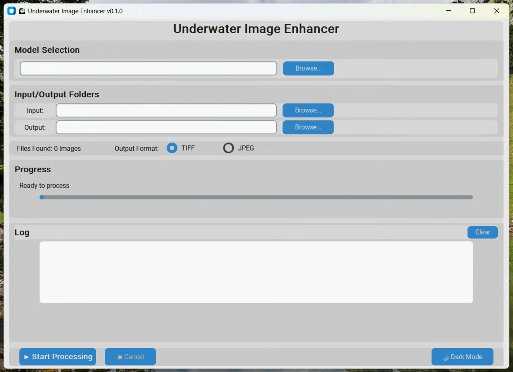

# Underwater Image Enhancer - GUI Application

Desktop application for enhancing underwater images with machine learning. No programming knowledge required.



## For Users: Download & Run

### Download Pre-built Application

Download the latest release for your platform:

- **Windows**: `UnderwaterEnhancer.exe`
- **macOS**: `UnderwaterEnhancer.app`
- **Linux**: `UnderwaterEnhancer`

Download from: [Releases Page](https://github.com/your-repo/releases)

### First-Time Setup

1. **Download a trained model** (.pth file):
   - Example models: https://drive.google.com/drive/u/0/folders/1Vdctr52LTxoS6eecFiGS5LROZYSqJ3vl

2. **Launch the application**

3. **Load model** using the "Select Model" button

4. **Start processing images!**

### Platform-Specific Instructions

#### Windows Security Warning
When running for the first time, Windows Defender SmartScreen may show a warning:

1. Click **"More info"**
2. Click **"Run anyway"**

This is normal for unsigned executables and is safe to bypass.

#### macOS Installation
See detailed instructions: [MACOS_APP_INSTALLATION.md](docs/MACOS_APP_INSTALLATION.md)

#### Linux
Make executable if needed:
```bash
chmod +x UnderwaterEnhancer
./UnderwaterEnhancer
```

## Features

- **Drag & Drop Interface** - Simply drag images into the application
- **Batch Processing** - Process hundreds of images at once
- **Real-time Preview** - See enhanced results instantly
- **Multiple Format Support** - GPR, JPEG, PNG, TIFF input formats
- **Progress Tracking** - Visual progress bars for batch operations
- **Dark/Light Themes** - Comfortable viewing in any environment
- **No Installation Required** - Standalone executable, just download and run

## User Guide

For complete usage instructions, see: [GUI User Guide](docs/GUI_README.md)

---

## For Developers

### Running from Source

```bash
# Install dependencies (first time only)
pip install -r requirements.txt

# Run the GUI application
python gui/app.py
```

### Building the Executable

```bash
# Build standalone executable for your platform (from project root)
pyinstaller gui/pyinstaller.spec

# Find the executable in:
# Windows: dist/UnderwaterEnhancer.exe
# macOS:   dist/UnderwaterEnhancer.app
# Linux:   dist/UnderwaterEnhancer
```

### Development Documentation

- [BUILD_README.md](../BUILD_README.md) - Build and packaging instructions
- [CLAUDE.md](../CLAUDE.md) - Developer guidance
- [GUI User Guide](docs/GUI_README.md) - End-user documentation

### Directory Contents

- **[app.py](app.py)** - Main GUI application entry point
- **[pyinstaller.spec](pyinstaller.spec)** - PyInstaller configuration for building standalone executables
- **[runtime_hook.py](runtime_hook.py)** - PyInstaller runtime hook for module imports
- **[requirements-gui.txt](requirements-gui.txt)** - GUI-specific Python dependencies
- **[docs/](docs/)** - GUI-specific documentation
- **[release_notes/](release_notes/)** - Version release notes

### Architecture

The GUI uses:
- **CustomTkinter** - Modern-looking GUI framework
- **PyInstaller** - For creating standalone executables
- **src/gui/** - Core GUI components (in parent src/ directory)
  - `main_window.py` - Main application window
  - `image_processor.py` - Image processing logic
