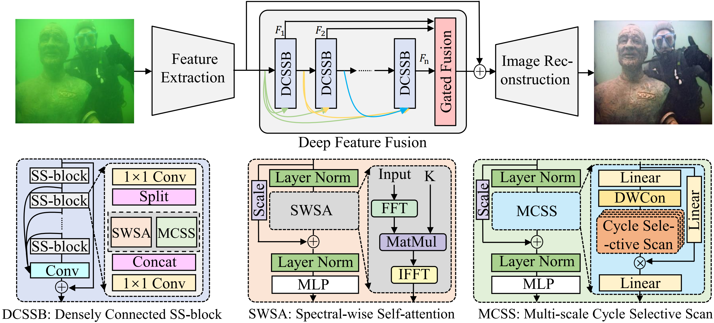
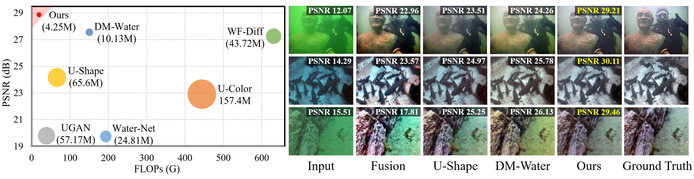

# Adaptive-Dual-domain-Learning-for-Underwater-Image-Enhancement

Welcome! This is the official implementation of the paper "[Adaptive Dual-domain Learning for Underwater Image Enhancement](https://ojs.aaai.org/index.php/AAAI/article/view/32692)".

[[📖 Paper](https://ojs.aaai.org/index.php/AAAI/article/view/32692)]  [[LSUI Datasets](https://github.com/LintaoPeng/U-shape_Transformer_for_Underwater_Image_Enhancement)]

## 💥 News
- **[2025.04]** We release the code and data for SS-UIE 🔧
- **[2024.12]** The conference paper is accepted by **AAAI 2025** 🎉
- **[2024.07]** The conference paper is submitted to AAAI 2025 🚀

## :art: Abstract

We propose a novel UIE method based on spatial-spectral dual-domain adaptive learning, termed SS-UIE. Specifically, we first introduce a spatial-wise Multi-scale Cycle Selective Scan (MCSS) module and a Spectral-Wise Self-Attention (SWSA) module, both with linear complexity, and combine them in parallel to form a basic Spatial-Spectral block (SS-block). Benefiting from the global receptive field of MCSS and SWSA, SS-block can effectively model the degradation levels of different spatial regions and spectral bands, thereby enabling degradation level-based dual-domain adaptive UIE. By stacking multiple SS-blocks, we build our SS-UIE network. Additionally, a Frequency-Wise Loss (FWL) is introduced to narrow the frequency-wise discrepancy and reinforce the model's attention on the regions with high-frequency details. Extensive experiments validate that the SS-UIE technique outperforms state-of-the-art UIE methods while requiring cheaper computational and memory costs.

<p align="center">
     <br>
</p>

The main contributions of our paper are as follows:
1. Our proposed MCSS and SWSA module can obtain the spatial-wise and spectral-wise global receptive fields with linear complexity, respectively, thereby modeling the degradation levels in different spatial regions and spectral bands.
2. We combined MCSS and SWSA in parallel to form an SS-block, which can reinforce the network's attention to the spatial regions and spectral bands with serious attenuation, and achieve degradation level-based adaptive UIE.  
3. The proposed FWL function can narrow the frequency-wise discrepancy, and force the model to restore high-frequency details adaptively without additional memory and computational costs.

Our SS-UIE outperforms SOTA UIE methods in quantitative evaluation and visual comparison with cheaper computational and memory costs.

<p align="center">
     <br>
</p>
  

## 💪 Get Started

### 1. Clone the repository:

   ```bash
   git clone https://github.com/LintaoPeng/SS-UIE.git
   cd SS-UIE
   ```

To set up the environment for this project, follow the steps below:

### 2. Create and Activate Conda Environment

```bash
conda create -n your_env_name python=3.10
conda activate your_env_name
```

### 3. Install PyTorch with CUDA Support

```bash
conda install pytorch==2.2.1 torchvision==0.17.1 torchaudio==2.2.1 pytorch-cuda=11.8 -c pytorch -c nvidia
```

### 3. Install CUDA Compiler (nvcc)

```bash
conda install -c "nvidia/label/cuda-11.8.0" cuda-nvcc
```

### 4. Install Additional Dependencies

```bash
conda install packaging
pip install timm
pip install scikit-image
pip install opencv-python
pip install causal-conv1d==1.1.1
pip install mamba-ssm==1.1.1
```

If you cannot install causal-conv1d and mamba-ssm, you can download the whl file we provide and install it directly using the local whl file. The download link is [causal-conv1d](https://drive.google.com/file/d/1Os8ibqmPF6ldN1EBBruY-90R8XERzG1K/view?usp=sharing) and [mamba-ssm](https://drive.google.com/file/d/1qj7VwDPMpCo0bpJLm4KLGwoCZhpAQenx/view?usp=sharing). Then run,

```bash
pip install causal_conv1d-1.2.0.post2+cu118torch2.1cxx11abiFALSE-cp310-cp310-linux_x86_64
pip install mamba_ssm-1.1.1+cu118torch2.1cxx11abiFALSE-cp310-cp310-linux_x86_64
```


### 🚀 Training

If you need to train our SS-UIE from scratch, you need to download the LSUI dataset from [BaiduYun](https://pan.baidu.com/s/1dqB_k6agorQBVVqCda0vjA)(password is lsui) or [GoogleDrive](https://drive.google.com/file/d/10gD4s12uJxCHcuFdX9Khkv37zzBwNFbL/view?usp=sharing), and then randomly select 3879 picture pairs as the training set to replace the data folder, and the remaining 400 as the test set to replace the test folder. The dataset divided by the author can be downloaded from [BaiduYun](https://pan.baidu.com/s/1xjc8hHc6IkUwg3cuPTogxg )(password is lsui).

Then, run the `train.py`, and the trained model weight file will be automatically saved in saved_ Models folder. 


## 📊 Testing
For your convenience, we provide some example datasets in `./data` folder.  You can download the pretrain models in [BaiduYun](https://pan.baidu.com/s/1E09432Bi-Fpm6Dv1veUCMQ?pwd=CKPT) with the password CKPT or in [Google Drive](https://drive.google.com/file/d/1YxyagMCbApON8dRdiQTaQG65g3tnZkPt/view?usp=sharing). 

After downloading, extract the pretrained model into the `./saved_models` folder, and then run `test.ipynb`. The code will use the pretrained model to automatically process all the images in the `./data/Test_400/input` folder and output the results to the `./data/Test_400/output` folder. 

## Dataset
The LSUI is a large-scale underwater image (LSUI) dataset, which involves richer underwater scenes (lighting conditions, water types and target categories) and better visual quality reference images than the existing ones. You can download it from [BaiduYun](https://pan.baidu.com/s/1dqB_k6agorQBVVqCda0vjA)(password is lsui) or [GoogleDrive](https://drive.google.com/file/d/1YxyagMCbApON8dRdiQTaQG65g3tnZkPt/view?usp=sharing). If you want to use the LSUI dataset, please cite our [[paper\]](https://ieeexplore.ieee.org/abstract/document/10129222)


## :white_check_mark: Citation

If you find this project useful for your research or applications, please kindly cite using this BibTeX:

```latex
@inproceedings{peng2025adaptive,
  title={Adaptive Dual-domain Learning for Underwater Image Enhancement},
  author={Peng, Lintao and Bian, Liheng},
  booktitle={Proceedings of the AAAI Conference on Artificial Intelligence},
  volume={39},
  number={6},
  pages={6461--6469},
  year={2025}
}
```


## 🧠 Related Work

- **[U-shape]** [U-shape Transformer for Underwater Image Enhancement](https://github.com/LintaoPeng/U-shape_Transformer_for_Underwater_Image_Enhancement)


